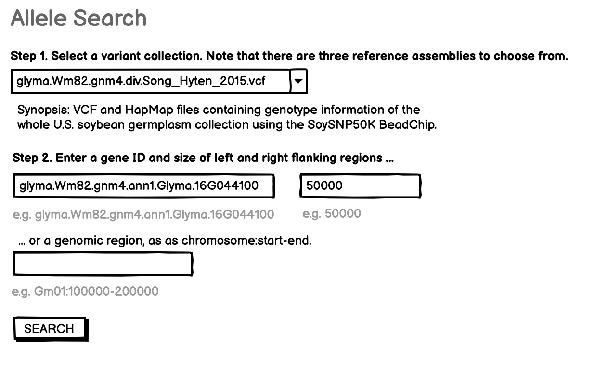
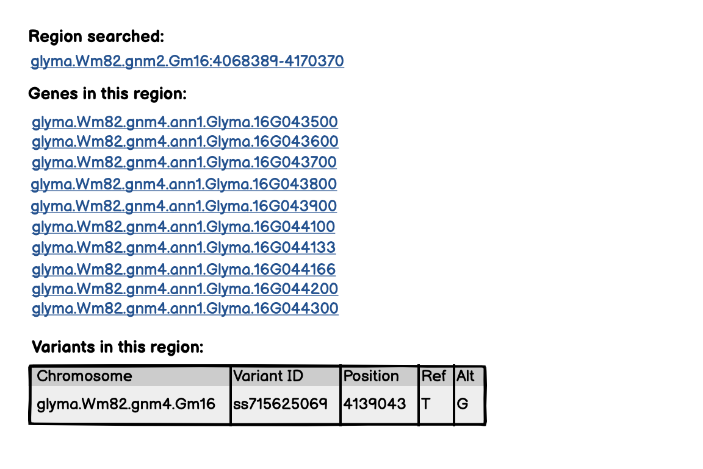

# Allele search query - to find variants (generally SNPs) around a gene or in a region, within a specified variant collection

This is the initial/draft requirements doc for the SoyBase allele search, to be implemented on the respective Jekyll web sites. This search component should enable search of specified variant collections (VCF files) in the vicinity of a specified gene or within a specified region. 
Note that the specification is for SoyBase first, partly because many VCF files are available for soybean. The specification and implementation may be generalized later for use with other species at LIS and PeanutBase.

## Specification version
Version: 0.5.0

<details>

The initial draft of this document, July 2024, is essentially for a prototype implementation, probably using a combination of the GCV microservices to return gene coordinates and the fasta-api services to return alleles from a range in a VCF. The first implementation will probably be done in in-page javascript rather than in a web component, since the GraphQL schema is not yet described for fasta-api.
</details>

## Input
A variant collection, as a VCF file
```
# Variant collections for assembly Wm82.a2 / Wm82.gnm2.ann1.RVB6
  Filename                                    ;                    Variant Collection                       ; Annotation Collection
  glyma.Wm82.gnm2.div.Song_Hyten_2015.vcf.gz ;                     Wm82.gnm2.div.Song_Hyten_2015            ; Wm82.gnm2.ann1.RVB6
  glyma.Wm82.gnm2.div.Torkamaneh_Laroche_2017.SNPdata.vcf.gz ;     Wm82.gnm2.div.Torkamaneh_Laroche_2017    ; Wm82.gnm2.ann1.RVB6
  glyma.Wm82.gnm2.div.Torkamaneh_Laroche_2019.NonSynSNPs.vcf.gz ;  Wm82.gnm2.div.Torkamaneh_Laroche_2019    ; Wm82.gnm2.ann1.RVB6
  glyma.Wm82.gnm2.div.Torkamaneh_Laroche_2019.SNPdata.vcf.gz ;     Wm82.gnm2.div.Torkamaneh_Laroche_2019    ; Wm82.gnm2.ann1.RVB6
  glyma.Wm82.gnm2.div.Valliyodan_Brown_2021.USB481.vcf.gz ;        Wm82.gnm2.div.Valliyodan_Brown_2021      ; Wm82.gnm2.ann1.RVB6
  glyma.Wm82.gnm2.div.Wickland_Battu_2017.SNPdata1.vcf.gz ;        Wm82.gnm2.div.Wickland_Battu_2017        ; Wm82.gnm2.ann1.RVB6
  glyma.Wm82.gnm2.div.Wickland_Battu_2017.SNPdata2.vcf.gz ;        Wm82.gnm2.div.Wickland_Battu_2017        ; Wm82.gnm2.ann1.RVB6
  glyma.Wm82.gnm2.div.Wickland_Battu_2017.SNPdata3.vcf.gz ;        Wm82.gnm2.div.Wickland_Battu_2017        ; Wm82.gnm2.ann1.RVB6
  glyma.Wm82.gnm2.div.Zhang_Jiang_2020.SNPdata_full.vcf.gz ;       Wm82.gnm2.div.Zhang_Jiang_2020           ; Wm82.gnm2.ann1.RVB6
  glyma.Wm82.gnm2.div.Zhang_Jiang_2020.SNPdata_maf01.vcf.gz ;      Wm82.gnm2.div.Zhang_Jiang_2020           ; Wm82.gnm2.ann1.RVB6

# Variant collections for assembly Wm82.a4 / Wm82.gnm4.ann1.T8TQ
  glyma.Wm82.gnm4.div.Song_Hyten_2015.vcf.gz ;                     Wm82.gnm4.div.Song_Hyten_2015            ; Wm82.gnm4.ann1.T8TQ
```

... and either 
- Gene ID, with prefix, e.g. "glyma.Wm82.gnm4.ann1.Glyma.16G044100" and size of left and right flanking regions (e.g. 50000)
or
- Genomic region, as chromosome:start-end, e.g. "Gm01:100000-200000"

- SEARCH button

Examples are shown below each text input element. (Selectors are self-explanatory.)

### Mockup



<hr><br>




<hr><br>

## Output

TBD

## Implementation notes

TBD

