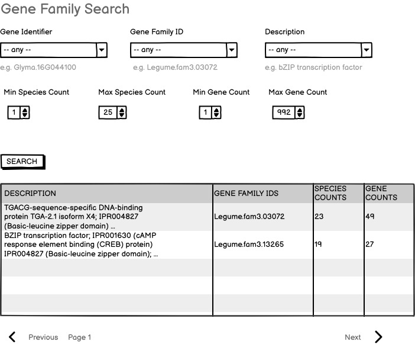

# Gene family search query

This is the requirements doc for the LIS/SoyBase/PeanutBase gene family search to be implemented on the LIS Jekyll web sites.

## Specification version
Version: 0.1

<details>

The first draft of this specification was completed in February 2025. 

</details>

## Input

- Gene Identifier ("-- any --" if not specified)
- Gene Family ID ("-- any --" if not specified)
- Description ("-- any --" if not specified)
- Min Species Count (numeric stepper; default 1; max determined by gene family set; 1 for fam3)
- Max Species Count (numeric stepper; default 25; max determined by gene family set; 25 for fam3)
- Min Gene Count (numeric stepper; default 1; max determined by gene family set; 1 for fam3)
- Max Gene Count (numeric stepper; default 992; max determined by gene family set; 992 for fam3)
- search button

Suitable example values:
- Gene Identifier: "e.g. Glyma.16G044100"
- Gene Family ID: "e.g. Legume.fam3.03072"
- Description: "e.g. bZIP transcription factor"


Examples are shown below each text input element. (Selectors are self-explanatory.)

### Mockup



## Output

The output will be in a tabular layout, with the following content in each gene-anchored row:

- DESCRIPTION
- GENE FAMILY IDS
- SPECIES COUNTS
- GENE COUNTS


## Implementation notes

- The species count selectors (min and max for species counts and gene counts) would be "nice-to-have" features but can be deferred or dropped if implementation is especially difficult -- which it might be if querying the family data is required in order to populate the values for the min and max parameters.
- The values for min and max come from this file in the datastore fam3 set: `legume.fam3.VLMQ/legume.fam3.VLMQ.sup1A_counts.tsv.gz`
- the query will be a GraphQL query run by a web component, which in turn runs an InterMine path query against LegumeMine.
- the linkouts are not specified here -- those are the purview of the Linkout Service specification, which also specifies how they are implemented on web components like this.

For testing, here are some values to try
```
Legume.fam3.03072
Glyma.03G142400
https://funnotate.legumeinfo.org/?family=legfed_v1_0.L_5J963W
http://dev.lis.ncgr.org:50082/?family=Legume.fam3.03072

Legume.fam3.01505
Medtr1g080920
http://dev.lis.ncgr.org:50082/?family=Legume.fam3.01505
https://funnotate.legumeinfo.org/?family=legfed_v1_0.L_3R6YP0

Legume.fam3.13265
Glyma.16G092700
http://dev.lis.ncgr.org:50082/?family=Legume.fam3.13265
https://funnotate.legumeinfo.org/?family=legfed_v1_0.L_GQ0S25

Legume.fam3.00317
Glyma.16G044100
http://dev.lis.ncgr.org:50082/?family=Legume.fam3.00317
https://funnotate.legumeinfo.org/?family=legfed_v1_0.L_0FWGQD
```

