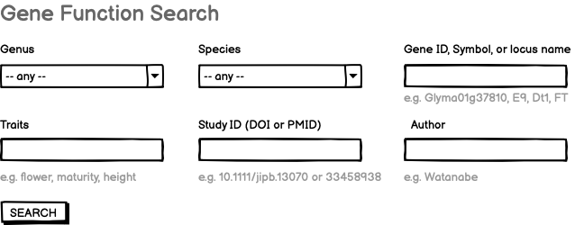
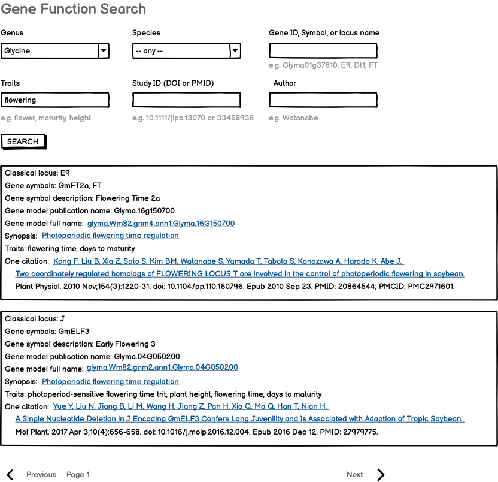
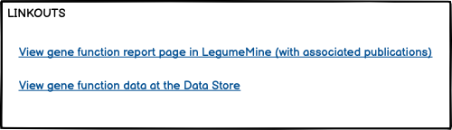

# Gene search query

This is the requirements doc for the LIS, SoyBase, and PeanutBase gene function search, to be implemented on the respective Jekyll web sites.

## Input

- Genus (selector with "any" on top)
- Species (selector populated if genus specified, otherwise only "any")
- Gene ID, Symbol, or Locus Name (text input)
- Traits (text input)
- Study ID (DOI or PMID) (text input)
- Author (text input)
- SEARCH button

Examples are shown below each text input element. (Selectors are self-explanatory.)

### Mockup

 

 

 

## Output

The output will be a paginated list of search results in *vertical display* form, containing:

Classical locus: E9  [Omit if not present in the data]
Gene symbols: GmFT2a, FT  [Flatten if a list is present. Omit if not present in the data]
Gene symbol description: Flowering Time 2a  [Omit if not present in the data]
Gene model publication name: Glyma.16g150700
Gene model full name: glyma.Wm82.gnm4.ann1.Glyma.16G150700  [Links to linkout box; same link as for Synopsis]
Synopsis: Photoperiodic flowering time regulation  [Links to linkout box; same link as for Gene model full name]
Traits: flowering time, days to maturity  [Flatten if a list is present]
One citation: Kong F. Liu B, Xia Z, Sato S, Kim BM. Watanabe S, Yamada T. Tabata S, Kanazawa A, Harada K, Abe J.
    Two coordinately regulated homologs of FLOWERING LOCUST are involved in the control of photoperiodic flowering in soybean.
    Plant Physiol. 2010 Nov; 154(3):1220-31. doi: 10.1104 /pp.110.160796. Epub 2010 Sep 23. PMID: 20864544; PMCID: PMC2971601.
  [Link will go to publication page in LegumeMine]

## Implementation notes

- the query will be a GraphQL query run by a web component, which in turn runs an InterMine path query against LegumeMine.
- the linkouts are not specified here -- those are the purview of the Linkout Service specification, which also specifies how they are implemented on web components like this.

