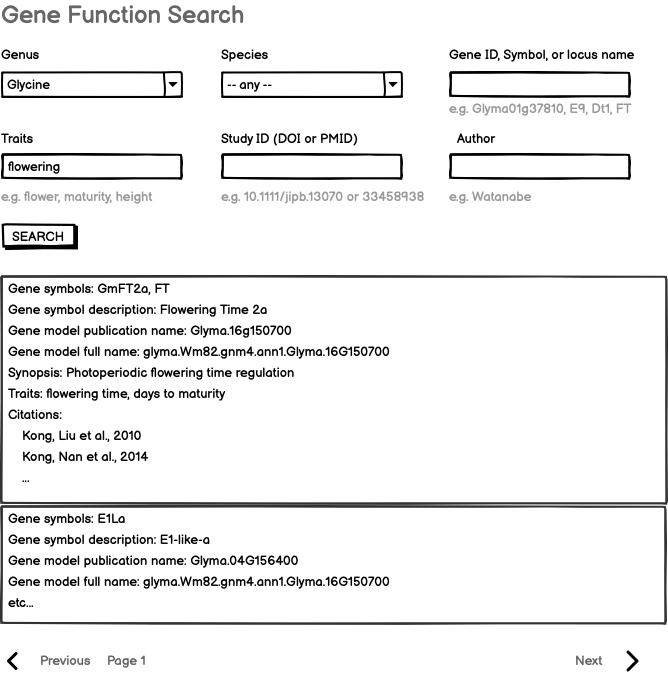

# Gene function search query

This is the requirements doc for the LIS, SoyBase, and PeanutBase gene function search, to be implemented on the respective Jekyll web sites. This should serve gene function information that is being curated at, for example, [https://data.legumeinfo.org/Glycine/max/gene_functions/](https://data.legumeinfo.org/Glycine/max/gene_functions/). Note though: the data will need to be incorporated into the Mines before this search functionality can be implemented.

## Specification version
Version: 0.9.1

This specification was completed in late June, 2023. The specification preceded availability of the data in the mines, so additional review and revision of the spec may be needed before the first implementation.

Revision 2025-09-29, after initial implementation of web component and Mine report page:

[https://mines.dev.lis.ncgr.org/jekyll-genefunction/web-components/user/lis-gene-function-search-element.html](https://mines.dev.lis.ncgr.org/jekyll-genefunction/web-components/user/lis-gene-function-search-element.html)

[https://mines.dev.lis.ncgr.org/minimine-genefunction-comments/genefunction:LjNIN](https://mines.dev.lis.ncgr.org/minimine-genefunction-comments/genefunction:LjNIN)

- Classical Locus: Let's not display this in the Web Component report, since it is usually null (though it would be good to include in the Mine symbol report page).
- Gene Symbols: Preferably, all symbols would be displayed for a given record. For example, for the record for publication 10.1104/pp.15.00164, the symbols would be "EIN2, Skl1". When multiple are present, use the first one to link to the InterMine report page for that symbol.
- Gene model pub name: We should display this. For publication 10.1104/pp.15.00164, it would be Medtr7g101410.
- Citations: Currently, DOIs for all citations are displayed. I think that is fine; but in that case, the category heading should be "Citations" rather than "One ctation"
- Linkouts: probably one from Gene symbol (linking to the Mine symbol report page) and one from Gene model full name (linking to all places a gene model ID can go). For citation, link directly to the InterMine publication record, via the DOI (but display the Author Author Year).

## Input

- Genus (selector with "any" on top)
- Species (selector populated if genus specified, otherwise only "any")
- Gene ID, Symbol, or Locus Name (text input)
- Traits (text input)
- Study ID (DOI or PMID) (text input)
- Author (text input)
- SEARCH button

Examples are shown below each text input element. (Selectors are self-explanatory.)

### Mockup

 

 

 

## Output

The output will be in a tabular layout, with the following content in each gene-name-anchored row:

- Gene model publication name: Glyma.16g150700
- Gene symbols: GmFT2a, FT  [Flatten if a list is present. Omit if not present in the data]
- Gene symbol description: Flowering Time 2a  [Omit if not present in the data]
- Gene model full name: glyma.Wm82.gnm4.ann1.Glyma.16G150700  [Links to linkout box for gene model IDs]
- Synopsis: Photoperiodic flowering time regulation  [Links to linkout box; same link as for Gene model full name]
- Traits: flowering time, days to maturity  [Flatten if a list is present]
- Citations: list of "Author, Author, Year" with linkouts via the DOI

## Implementation notes

- the query will be a GraphQL query run by a web component, which in turn runs an InterMine path query against LegumeMine.
- the linkouts are not specified here -- those are the purview of the Linkout Service specification, which also specifies how they are implemented on web components like this.

## Changes during implementation in fall 2025
- Because "Classical locus" is present in so few of the data records, let's omit this in the web copmponent report. Do include it on the Mine report page however.
- Citation: list of "Author, Author, Year" with linkouts via the DOI

