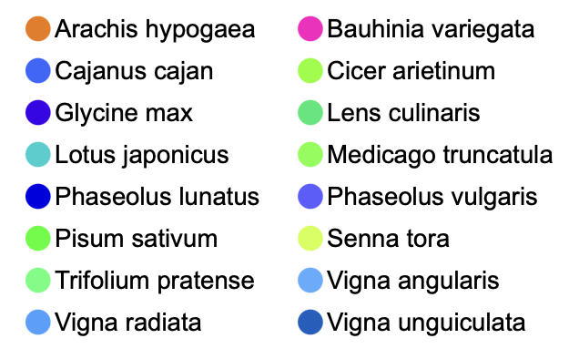
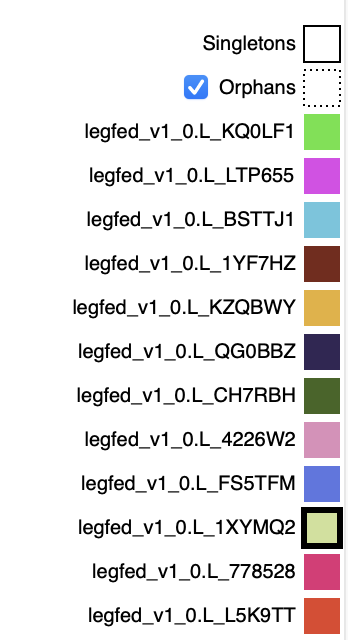

# Phylotree viewer for gene families -- as a web component

This is the requirements doc for the species legend web component

## Specification version
Version: 0.1.0

The initial spec (0.1.0) was drafted 2025-04-02.

## Objective
The purpose of this component is to provide a legend that associated named entities (e.g. species) with symbols (e.g. colored Xs or squares).
It is presumed that this component will be paired with others on a webpage. Current applications would be the phylotree viewer and the Genome Context Viewer.

## Essential features:

  - Layout options suited to the envisioned applications
  - Ability to receive data to be used for labels and associated symbols
  - Ability to communicate actions to other components (actions being clicks or rollovers, depending on context)

## Desirable but not essential features:
  - Snapshot to SVG

## Desired layout options:

### Tabular layout, horizontally-arrayed:

  |                      |                   |                      |                     |
  | ---------------------| ----------------- | -------------------- | ------------------- |
  | [X] Genus species    | [X] Genus speci   | [X] Genus species    | [X] Genus speciess  |
  | [X] Genus spec       | [X] Genus spe     | [X] Genus speciess   | [X] Genus spec      |
  | [X] Genus speciesss  | [X] Genus sp

### Vertical layout, X-before:

  |                     |
  | :------------------ |
  | [X] Genus species   |
  | [X] Genus spec      |
  | [X] Genus speciesss |
  | [X] Genus speci     |
  | [X] Genus spe       |
  | [X] Genus sp        |
  | [X] Genus species   |
  | [X] Genus speciess  |
  | [X] Genus spec      |

### Vertical layout, X-after:

  |                      |
  | -------------------: |
  | Genus species    [X] |
  | Genus spec       [X] |
  | Genus speciesss  [X] |
  | Genus speci      [X] |
  | Genus spe        [X] |
  | Genus sp         [X] |
  | Genus species    [X] |
  | Genus speciess   [X] |
  | Genus spec       [X] |

