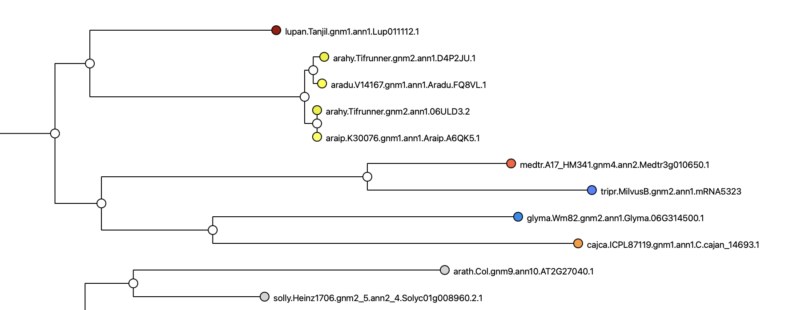
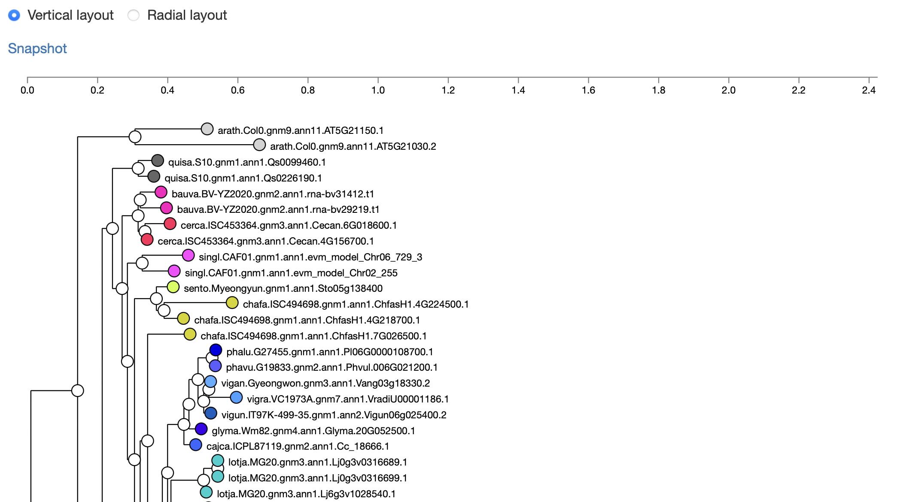

# Phylotree viewer for gene families -- as a web component

This is the initial/draft requirements doc for the phylotree web component (the spec lagging the development by about three years!)

## Specification version
Version: 0.5.0

The initial draft of this document (0.5.0), 2025-02-27, is basically a review of the lis-phylotree web component that was written in summer/fall 2022. 
It is an assessment of features relative to the in-production R-Shiny funnotate phylotree viewer.

The repository as of February 2025 is:
[lis-phylotree](https://github.com/legumeinfo/web-components/tree/component/lis-phylotree)

## Objective
The purpose of the lis-phylotree component is for display of gene trees containing IDs from several species, with coloring by species and at least some interactivity.

Relative to the R-shiny phylotree viewer that is in production (e.g. http://dev.lis.ncgr.org:50082/?family=Legume.fam3.07454),

### Essential features:

  - Coloring of nodes by species (fine)
  - Linkouts from sequence nodes, as funnotate (to-add)
  - Gene family name and functional description

### Desirable but not essential features:
  - Snapshot to SVG
  - Gene family help (links to a static page)
  - Linkouts from internal nodes, as funnotate
    - Collapse tree at this node, as funnotate
    - Focus on subtree at this node, as funnotate
    - Export tree in Newick format from internal node, as funnotate
    - GCV multiple alignment from internal node, as funnotate
  - MSA visualization
  - Interactive legend (allows removal of taxa from tree)

### Not needed
  - Radial layout

## Comparison of phylotree component as of Feb 2025 with funnotate (at development server)

 

 

