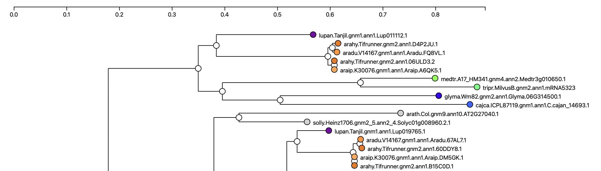

# Phylotree viewer for gene families -- as a web component

This is the requirements doc for the phylotree web component

## Specification version
Version: 0.6.0

The initial draft of this document (0.5.0), 2025-02-27, is basically a review of the lis-phylotree web component that was written in summer/fall 2022. 
It is an assessment of features relative to the in-production R-Shiny funnotate phylotree viewer.

The spec was updated (0.6.0) on 2025-04-02 to reflect the separation into separate, modular components, including at least (1) phylotree viewer and (2) legend. The legend component is spec'd separately.

## Objective
The purpose of the lis-phylotree component is for display of gene trees containing IDs from several species, with coloring by species and at least some interactivity.

Relative to the R-shiny phylotree viewer that is in development (accessible-but-unlinked, e.g. http://dev.lis.ncgr.org:50082/?family=Legume.fam3.07454),

## Essential features:

  - Coloring of nodes by species (fine)
  - Linkouts from sequence nodes, as funnotate (to-add)
  - Gene family name and functional description

## Relation of phylotree component to other components in page

The phylotree component may be used in various contexts. The primary context envisioned currently is in
per-gene-family pages that include the the tree viewer as the main focus, but also including an interactive legend
(implemented as a separate web component), gene family functional description, and possibly widgets
for exporting SVG images and for MSA visualization.

## Draft implementation

The phylotree web components repository as of February 2025 is:
[lis-phylotree](https://github.com/legumeinfo/web-components/tree/component/lis-phylotree)

