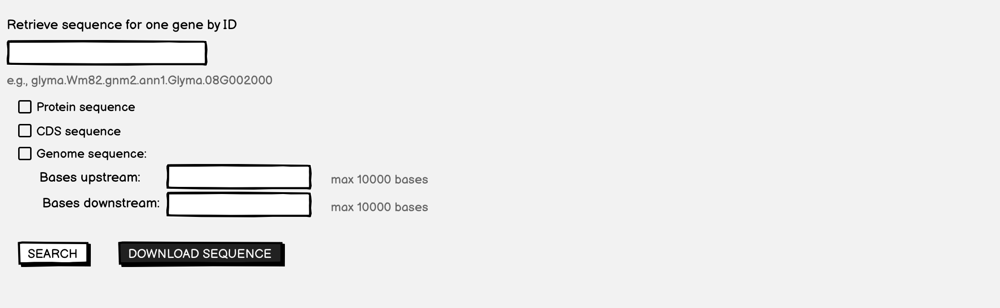
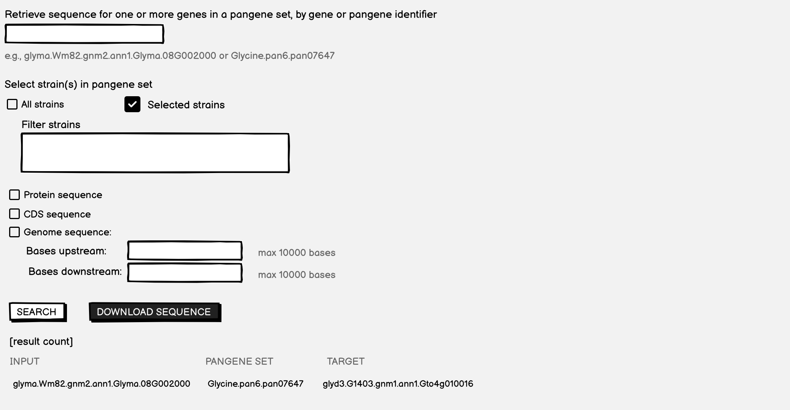
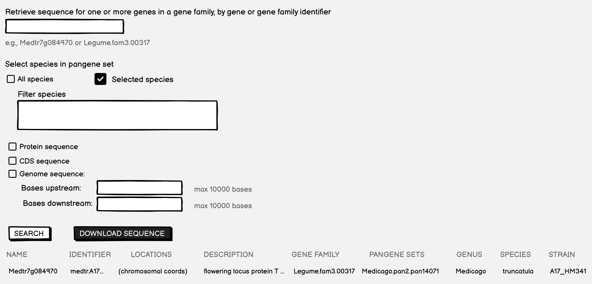

# Retrieve Sequence Sets

This is the initial/draft requirements doc for a set of related interfaces for retrieving sequence sets. I think these would probably be implemented as three distinct web components, but it would be natural to include the three together on one Jekyll page at the respective Jekyll project websites. 

Each of the three components would permit a search of one or more identifiers and would return the corresponding sequence -- either CDS, protein, or genomic, as requested by the user.

In each case, the result returned to the user would be a file of sequence (fasta format). It would probably be best to also provide a tabular result, similar to the "lis-gene-search-element" or the "lis-pangene-lookup-element", with a Download button similar to the "lis-pangene-lookup-element" but containing fasta sequence rather than the table.

## Specification version
Version: 0.5.0

The initial draft of this document (0.5.0) was composed on 2026-04-16

## Retrieve sequence for one gene by gene ID

### Mockup

 

## Retrieve sequences for genes in a pangene set, by gene or pangene identifier

### Mockup

 

## Retrieve sequences for genes in a gene family, by gene or gene family identifier

### Mockup

 

