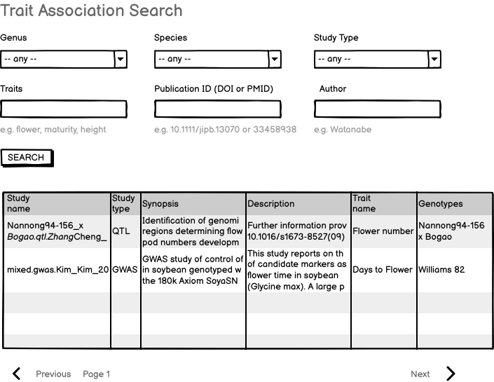
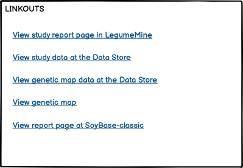

# Trait association search query - for GWAS and QTL data

This is the requirements doc for the LIS, SoyBase, and PeanutBase trait association search, to be implemented on the respective Jekyll web sites. This search component should enable search of both QTL and GWAS studies. The primary (though not exclusive) link targets are the QTL and GWAS reports at the LIS InterMine instances -- for example, [GWAS "days to flower"](https://mines.legumeinfo.org/glycinemine/report.do?id=145000005) or [QTL "first flower"](https://mines.legumeinfo.org/glycinemine/report.do?id=235000009).

## Specification version
Version: 1.2.0

This specification was completed in mid-July, 2023, and is ready for initial implementation (v1.0).

A change was made to the spec on Oct 4 (v1.1.0) to reflect the current implementation of the search results to have a tabular rather than vertical layout - though this change is primarily for (assumed) ease of implementation rather than for functionality or esthetics. See discussion near the results section. Also, a minor change in a search text-entry field: from "Study ID" to Publication ID".

A change was made to the spec on Nov 17 (v1.2.0), noting that the component will have the ability to have its genus and species selectors pre-set to specific values; and for the species to be pre-set in the gene search component.

## Input

- Genus (selector with "any" on top, unless pre-set to some value, e.g. Glycine)
- Species (selector populated if genus specified, otherwise only "any" - unless pre-set to some value, e.g. max)
- Study Type (selector with "any" on top; values GWAS or QTL)
- Traits (text input)
- Publication ID (DOI or PMID) (text input)
- Author (text input)
- SEARCH button

Examples are shown below each text input element. (Selectors are self-explanatory.)

Note that there are two versions of the report layouts in the mockups: one with the fields layed out vertically (key: value pairs each on their own line),
and one layed out in a tabular layout, with keys serving as column headers and values for each record comprising a row in the table.
See further discussion below, under Output.

### Mockup

 

 

 

 

## Output

Note continuing discussion of report layout: For the data in this search and report, the vertical layout is probably preferable esthetically, 
and wrapping of long text items will be needed. However, the choice of the layout is left to the implementer, at least in this version of the spec (1.1.x).
I assume that tabular layout will be more straightforward at this point, and that is acceptable in order to get
an initial implementation in place.

Assuming tabular layout for this implementation (1.1.x), the following content will be in in each collection-anchored row:

- Study datastore collection name (linked to Linkout Service) e.g. `Nannong94-156_x_Bogao.qtl.Zhang_Cheng_2010`
- Study type -- either GWAS or QTL
- Synopsis, from datastore collection README, e.g. "Identification of genomic regions determining flower and pod numbers development in soybean (Glycine max L.)"
- Description, from datastore collection README, e.g. "Further information provided in 10.1016/s1673-8527(09)60074-6"
- Trait names, from datastore obo.tsv file or (equivalently) from the mine QTL study, field "Qtls
Trait" or GWAS study, field "Ontology Annotations Term Name", e.g. "Pod number, Plant height"
- Genotypes: e.g. `Jiyu69 x SS0404-T5-76` (QTL) or `809 soybean accessions` (GWAS)

## Implementation notes

- the query will be a GraphQL query run by a web component, which in turn runs an InterMine path query against LegumeMine.
- the linkouts are not specified here -- those are the purview of the Linkout Service specification, which also specifies how they are implemented on web components like this.
