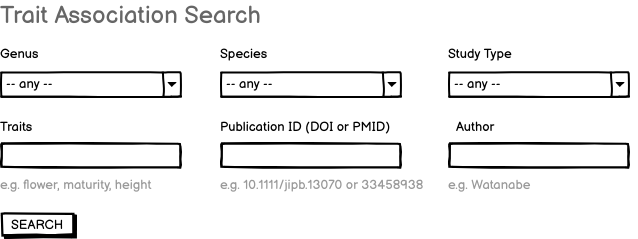

# Gene search query

This is the requirements doc for the LIS, SoyBase, and PeanutBase trait association search, to be implemented on the respective Jekyll web sites. This search component should enable search of both QTL and GWAS studies. The primary (though not exclusive) link targets are the QTL and GWAS reports at the LIS InterMine instances -- for example, [GWAS "days to flower"](https://mines.legumeinfo.org/glycinemine/report.do?id=145000005) or [QTL "first flower"](https://mines.legumeinfo.org/glycinemine/report.do?id=235000009).

## Input

- Genus (selector with "any" on top)
- Species (selector populated if genus specified, otherwise only "any")
- Study Type (selector with "any" on top; values GWAS or QTL)
- Traits (text input)
- Study ID (DOI or PMID) (text input)
- Author (text input)
- SEARCH button

Examples are shown below each text input element. (Selectors are self-explanatory.)

### Mockup

 

 

 

## Output

The output will be a paginated list of search results in *vertical display* form, containing:

- Study datastore collection name (linked to Linkout Service) e.g. `Nannong94-156_x_Bogao.qtl.Zhang_Cheng_2010`
- Study type -- either GWAS or QTL
- Synopsis, from datastore collection README, e.g. "Identification of genomic regions determining flower and pod numbers development in soybean (Glycine max L.)"
- Description, from datastore collection README, e.g. "Further information provided in 10.1016/s1673-8527(09)60074-6"
- Trait names, from datastore obo.tsv file or (equivalently) from the mine QTL study, field "Qtls
Trait" or GWAS study, field "Ontology Annotations Term Name", e.g. "Pod number, Plant height"
- Genotypes: e.g. `Jiyu69 x SS0404-T5-76` (QTL) or `809 soybean accessions` (GWAS)

## Implementation notes

- the query will be a GraphQL query run by a web component, which in turn runs an InterMine path query against LegumeMine.
- the linkouts are not specified here -- those are the purview of the Linkout Service specification, which also specifies how they are implemented on web components like this.
